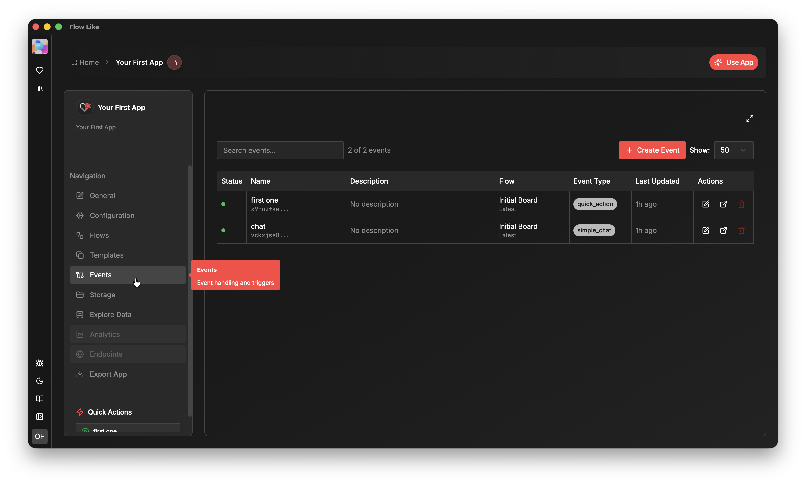

With **Events** you can link your **Flows** to the outside world.

Creating an **Event** requires that you have built at least one **Flow** in your app including an *event node*. You can create *Flows* in the **Flows** section of your app within [Boards](/apps/boards/).

Each **Event** points to a specific *event node* within a specific *Board* of your app. You can create multiple (but different) *Events* pointing to the same *event node* and differentiate them by their *Event* payloads and configurations.

## Event Types

### Quick Action
This is basically a button to trigger a *Flow* manually. You can define additional variables that pass individual data to the *Flow* triggered.

### Chat Event
Creating a *Chat Event* allows you to invoke a *Flow* via a chat interface ([which you'll automatically get when creating such an event](/apps/chat-ui/)). A *chat event* passes the chat context (e.g. the chat history) as payload to your *chat event node*. You can configure additional payloads such as file attachments, tools and default prompts.
