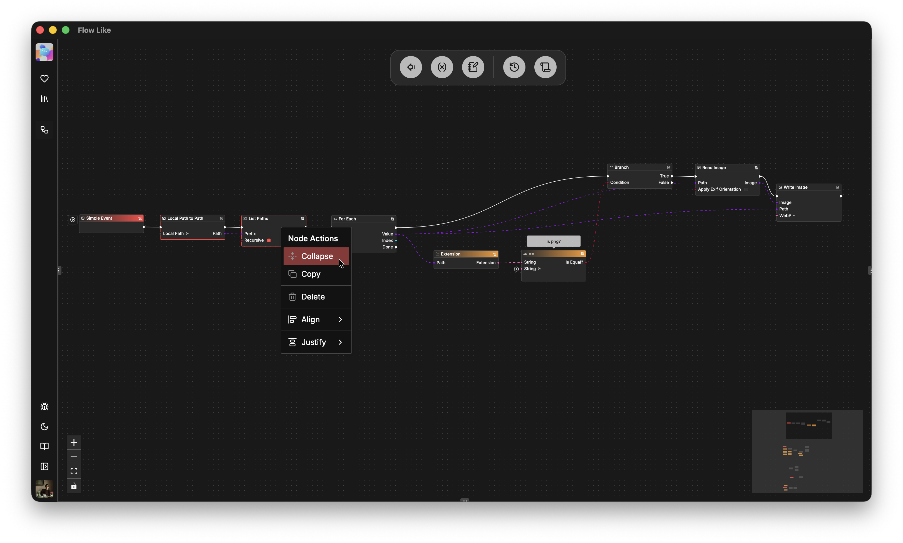
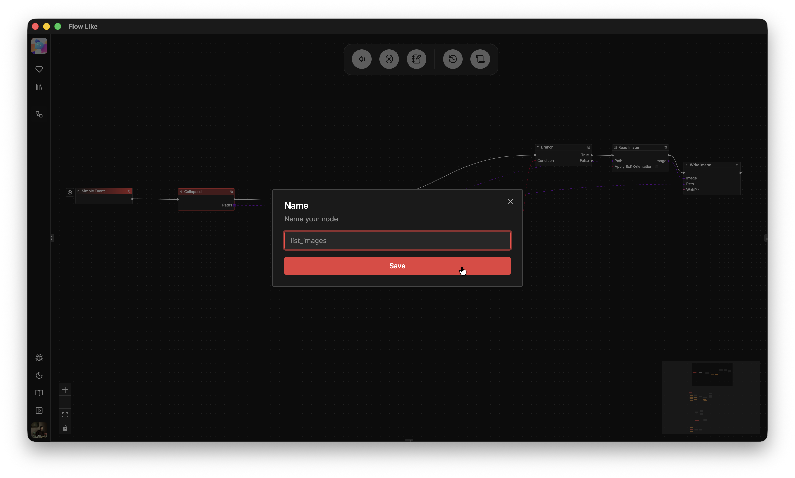
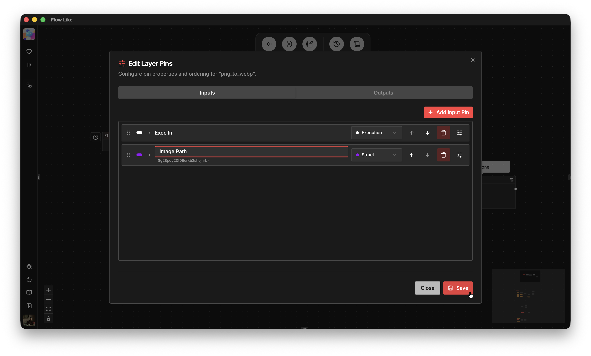
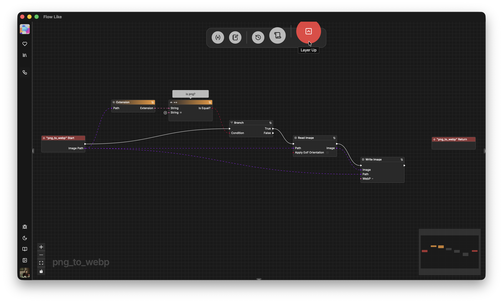
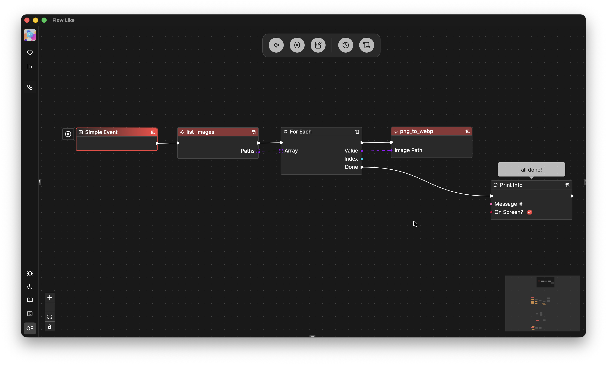
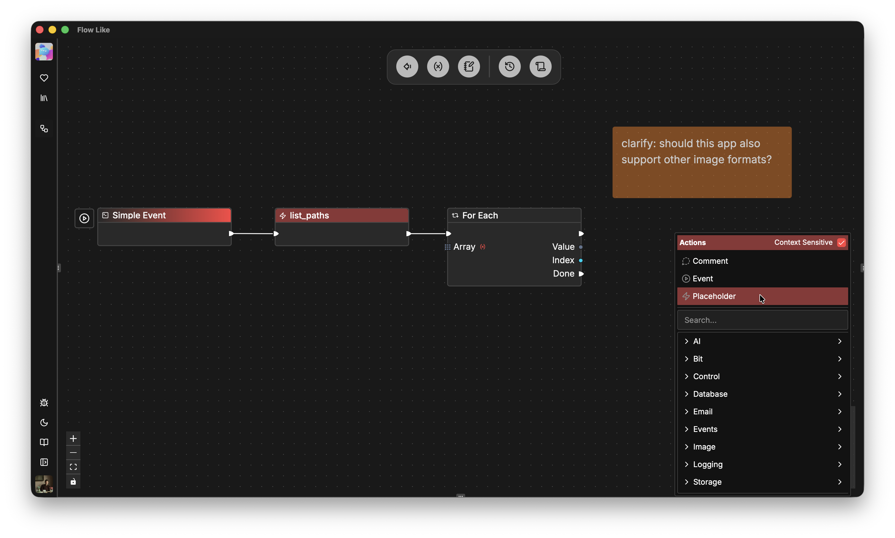

*Layers* and *Placeholders* are powerful features of Flow-Like Studio for abstraction and prototyping in your automations. They refer to the same functionality: creating nested or collapsed flows *within* flows. You can also think of them as a "third dimension" in your boards.

## Collapsing Existing Nodes into New Layers

At some point in your flow creation process, you might want to "summarize" nodes either because you need certain combinations multiple times or because the canvas becomes too cluttered.

To do so, you can select two or more nodes and *collapse* them into a *Layer*:

The resulting collapsed *Layer* is represented by a *Placeholder* node that can now be renamed to describe what is happening inside:

Once created, you can also *edit* the input and output pins of a layer to either change the type or modify the pin names:

Clicking on a *layer* / *placeholder node* allows you to navigate inside. Here you can see the part of the flow that was previously collapsed. Inputs and outputs connecting the inside to the outside are represented by *start* and *return* nodes:

Collapsing nodes into layers allows you to create meaningful abstractions of your flow graph, so that the top layer effectively represents the core logic of your application:

Note that collapsed nodes retain all properties of standard nodes, including typing, wiring, copying, etc. You can even collapse them again, creating further levels of abstraction.

## Prototype with Placeholders

*Placeholder* nodes are *layers* that are simply *empty*. This allows you to quickly prototype your application logic and implement it *later*.

You can select placeholder nodes from the node catalog and then rename or edit their pins as described above:

With placeholders, you can visually design your application, potentially defining some initial execution connections or pin types. Once you feel confident that the overall layout works, you can start implementing each placeholder.
