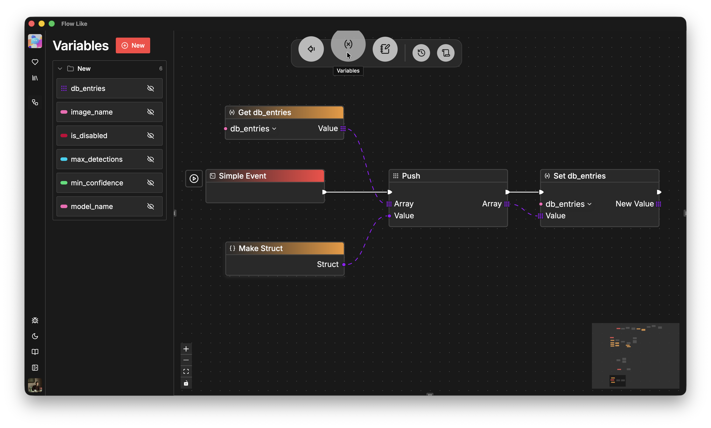

Variables act as shared, in-memory storage on board level. Typical scenarios to use variables could be:
- You want to configure the name of our database and use it in multiple flows (e.g. for ingesting and for retrieval).
- You want to (recursively) scrape a website for outgoing links and push every link into an array.
- At every *While Loop* iteration you are a evaluating whether a certain condition is still *true*. You set the condition somewhere downstream in the *While Loop* leaf branch.

All flows within a board can read/write variables through *Get Variable* and *Set Variable* nodes:
- To *read* a variable either search in the node catalog for *Get variable_name* or drag and drop the variable on the canvas from the variables menu.
- Similarily, to *write* a variable, either search for *Set variable_name* or drag it as well.

To specify the variable *type*, open the variables menu, click on the variable you want to configure and select the type from the drop down:

To specify the variable *value* (*Single*, *Array*, *Set*, or *Map*), click on the pil-shaped color indicator next to *Variable Types*:
